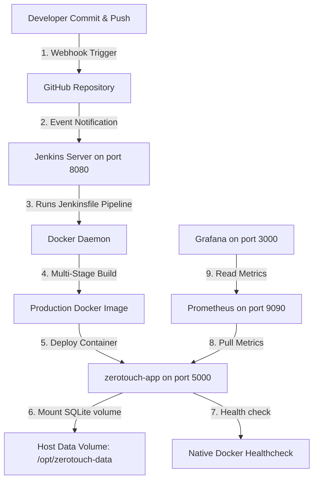

# Zero Touch App — Enterprise DevOps & Cloud Monitoring Project

Welcome to the **Zero Touch App** repository. This project is a complete showcase of modern Cloud Infrastructure, GitOps-driven CI/CD Automation, Containerization, Resource Management under constraints, and full-stack Monitoring (Prometheus & Grafana).

Originally a CI/CD dashboard, this project has been pivoted into a **Desi Social Media App** (with Feeds, Boards, Reels, Communities, and Profile features) built on Flask, SQLite, and Gunicorn, and deployed to **AWS EC2** using a fully automated pipeline.

---

## 🏗️ System Architecture

The following diagram illustrates the GitOps workflow and deployment architecture:



---

## ☁️ 1. AWS EC2 Cloud Infrastructure & Resource Allocation

### Hardware & OS Details:
* **Cloud Provider:** Amazon Web Services (AWS)
* **Instance Type:** `t3.micro` (1 Virtual CPU, 1 GiB RAM)
* **Operating System:** Ubuntu Linux 24.04 LTS
* **Public IP:** `40.192.3.142`

### 🧠 Resolving Hardware Constraints (Swap Space Engineering)
Operating on a `t3.micro` instance with only **1GB RAM** presents a high risk of **Out-Of-Memory (OOM)** kernel panics during heavy operations (like running Jenkins, Docker builds, Prometheus, and Grafana simultaneously). 
To make the system stable, we configured a custom **1.0 GiB Swap Space** on the host. 

When RAM runs low, the kernel swaps inactive pages out to the disk, preserving stability.
```bash
# Swap Configuration Script
sudo dd if=/dev/zero of=/swapfile bs=1M count=1024
sudo chmod 600 /swapfile
sudo mkswap /swapfile
sudo swapon /swapfile
```
* **Host RAM:** `911 MiB`
* **Configured Swap:** `1024 MiB (1.0 GiB)`

### 🔒 Network Configuration (Security Group rules)
The AWS Security Group is configured to expose the following ports:
* **Port 22:** Secure Shell (SSH) access for remote administration.
* **Port 8080:** Jenkins UI and GitHub webhook endpoint.
* **Port 5000:** Live Python Flask/Gunicorn web application.
* **Port 9090:** Prometheus Web UI.
* **Port 3000:** Grafana Dashboard UI.

---

## 🔧 2. CI/CD Pipeline Configuration (`Jenkinsfile`)

We implemented a **Declarative Pipeline** defined in a `Jenkinsfile` in the root of the repository. Jenkins fetches this file on every GitHub push via a Webhook trigger, automating compilation, validation, and zero-touch deployment.

### Key Jenkins Configurations:
* **Concurrency Protection:** Disabled concurrent builds to prevent port conflicts on a single-node host.
* **Build Discarder:** Keeps only the last 5 builds to save disk space.
* **Auto-Rollback:** If the new container fails the health check, Jenkins restarts the previous container automatically.

### The [Jenkinsfile](file:///d:/Downloads%20D/Cloud%20And%20Devops%20Project/Zero-Touch-App/Jenkinsfile) Code:
```groovy
pipeline {
    agent any

    environment {
        IMAGE_NAME     = 'zerotouch-app'
        CONTAINER_NAME = 'zerotouch-app'
        APP_PORT       = '5000'
        DB_VOLUME_PATH = '/opt/zerotouch-data'
    }

    options {
        buildDiscarder(logRotator(numToKeepStr: '5'))
        timeout(time: 15, unit: 'MINUTES')
        disableConcurrentBuilds()
    }

    stages {
        // Stage 1: Checkout the code from GitHub
        stage('📥 Checkout') {
            steps {
                echo '=== Pulling latest code from GitHub ==='
                checkout scm
                sh 'git log -1 --format="%H %s %an" | tee build-info.txt'
            }
        }

        // Stage 2: Compile the production Docker image
        stage('🐳 Build Docker Image') {
            steps {
                echo '=== Building Docker image ==='
                sh """
                    docker build \
                        --tag ${IMAGE_NAME}:${BUILD_NUMBER} \
                        --tag ${IMAGE_NAME}:latest \
                        --label "build.number=${BUILD_NUMBER}" \
                        --label "build.git.commit=\$(git rev-parse --short HEAD)" \
                        --label "build.timestamp=\$(date -u +%Y-%m-%dT%H:%M:%SZ)" \
                        .
                """
            }
        }

        // Stage 3: Stop old running container
        stage('🛑 Stop Old Container') {
            steps {
                echo '=== Stopping existing container (if any) ==='
                sh """
                    docker stop ${CONTAINER_NAME} 2>/dev/null || echo 'No running container'
                    docker rm   ${CONTAINER_NAME} 2>/dev/null || echo 'No container'
                """
            }
        }

        // Stage 4: Prepare Data Directory
        stage('📁 Prepare Data Volume') {
            steps {
                echo '=== Ensuring DB volume directory exists on host ==='
                sh "mkdir -p ${DB_VOLUME_PATH}"
            }
        }

        // Stage 5: Deploy the container with memory restrictions
        stage('🚀 Deploy') {
            steps {
                echo '=== Starting new container ==='
                sh """
                    docker run -d \
                        --name ${CONTAINER_NAME} \
                        --restart unless-stopped \
                        -p ${APP_PORT}:5000 \
                        -v ${DB_VOLUME_PATH}:/app/instance \
                        -e FLASK_ENV=production \
                        -e DATABASE_URL=sqlite:////app/instance/zerotouch_social.db \
                        -e SECRET_KEY=zerotouch-bharat-prod-secret-2024 \
                        --memory="400m" \
                        --memory-swap="800m" \
                        --cpus="0.8" \
                        ${IMAGE_NAME}:latest
                """
            }
        }

        // Stage 6: Post-Deployment HTTP Health Check
        stage('🩺 Health Check') {
            steps {
                echo '=== Waiting for app to start... ==='
                sh 'sleep 10'
                sh """
                    curl --fail --silent --max-time 10 \
                         http://localhost:${APP_PORT}/health \
                    | python3 -m json.tool \
                    || (echo '❌ Health check FAILED' && exit 1)
                """
            }
        }

        // Stage 7: Clean old untagged Docker images to save host disk space
        stage('🧹 Cleanup') {
            steps {
                echo '=== Removing dangling/old Docker images to free disk ==='
                sh 'docker image prune -f'
                sh """
                    docker images ${IMAGE_NAME} --format "{{.Tag}}" \
                    | grep -E '^[0-9]+\$' \
                    | sort -n \
                    | head -n -3 \
                    | xargs -I {} docker rmi ${IMAGE_NAME}:{} 2>/dev/null || true
                """
            }
        }
    }
}
```

---

## 🐳 3. Production Containerization (`Dockerfile` & `.dockerignore`)

We use a **Multi-Stage Docker Build** to separate the compilation environment from the execution environment. This significantly reduces the size of the final image (reducing it to **~130MB**) and eliminates build tools (like `gcc` and `make`) from the final image, minimizing security vulnerabilities.

### The [Dockerfile](file:///d:/Downloads%20D/Cloud%20And%20Devops%20Project/Zero-Touch-App/Dockerfile):
```dockerfile
# ── Stage 1: Build dependencies ─────────────────────────────────
FROM python:3.11-slim AS builder
WORKDIR /app
COPY requirements.txt .
RUN pip install --no-cache-dir --upgrade pip \
    && pip install --no-cache-dir -r requirements.txt

# ── Stage 2: Production image ────────────────────────────────────
FROM python:3.11-slim

# Security Hardening: Run as non-root user 'zerotouch'
RUN groupadd -r zerotouch && useradd -r -g zerotouch zerotouch
WORKDIR /app

# Copy packages compiled from the builder stage
COPY --from=builder /usr/local/lib/python3.11/site-packages /usr/local/lib/python3.11/site-packages
COPY --from=builder /usr/local/bin/gunicorn /usr/local/bin/gunicorn
COPY --from=builder /usr/bin/curl /usr/bin/curl
COPY --from=builder /usr/lib /usr/lib

# Copy application code
COPY . .

# Grant write access to instance directory for SQLite DB
RUN mkdir -p /app/instance && chown -R zerotouch:zerotouch /app
USER zerotouch
EXPOSE 5000

# Native Container Health Check
HEALTHCHECK --interval=30s --timeout=10s --start-period=15s --retries=3 \
    CMD curl -f http://localhost:5000/health || exit 1

# Production server run command via Gunicorn WSGI
CMD ["gunicorn", \
     "--bind", "0.0.0.0:5000", \
     "--workers", "2", \
     "--threads", "2", \
     "--timeout", "120", \
     "--access-logfile", "-", \
     "--error-logfile", "-", \
     "--log-level", "info", \
     "app:app"]
```

### The [.dockerignore](file:///d:/Downloads%20D/Cloud%20And%20Devops%20Project/Zero-Touch-App/.dockerignore) File:
Excludes temporary files, local databases, and credentials to keep the Docker context lightweight and protect secrets.
```
.git
.gitignore
__pycache__
*.pyc
*.db
*.sqlite
*.pem
.env
Dockerfile
Jenkinsfile
```

---

## 📊 4. Monitoring Architecture (Prometheus & Grafana)

The application has enterprise monitoring built directly into the container stack:
1. **Metrics Export:** The Flask application uses the `prometheus-flask-exporter` library to expose standard HTTP request and process metrics on a `/metrics` route.
2. **Prometheus Scraping:** Prometheus runs in a dedicated container on the `monitoring` bridge network, pulling metrics from the application container every 10 seconds.
3. **Visualization:** Grafana runs in another container, connecting to Prometheus as a data source to display live telemetry.

### The [Prometheus Config](file:///d:/Downloads%20D/Cloud%20And%20Devops%20Project/Zero-Touch-App/monitoring/prometheus.yml) (`prometheus.yml`):
```yaml
global:
  scrape_interval:     15s   # Scrape targets every 15s
  evaluation_interval: 15s   # Evaluate alert rules every 15s

rule_files:
  - "alert_rules.yml"

scrape_configs:
  - job_name: 'prometheus'
    static_configs:
      - targets: ['localhost:9090']

  - job_name: 'zerotouch_app'
    metrics_path: '/metrics'
    scrape_interval: 10s
    static_configs:
      - targets: ['zerotouch-app:5000']
        labels:
          app:         'zerotouch-app'
          environment: 'production'

  - job_name: 'node_exporter'
    scrape_interval: 30s
    static_configs:
      - targets: ['localhost:9100']
```

### The [Alerting Rules](file:///d:/Downloads%20D/Cloud%20And%20Devops%20Project/Zero-Touch-App/monitoring/alert_rules.yml) (`alert_rules.yml`):
Defines thresholds for Prometheus. If a threshold is crossed, Prometheus triggers an alert.
```yaml
groups:
  - name: zerotouch_alerts
    rules:
      # Alert if the app is down for more than 1 minute
      - alert: AppDown
        expr: up{job="zerotouch_app"} == 0
        for: 1m
        labels:
          severity: critical
        annotations:
          summary: "ZeroTouch App is DOWN!"
          description: "Instance {{ $labels.instance }} has been offline for over 1 minute."

      # Alert if latency is high (P95 > 2 seconds)
      - alert: HighLatency
        expr: histogram_quantile(0.95, sum(rate(flask_http_request_duration_seconds_bucket[5m])) by (le)) > 2
        for: 2m
        labels:
          severity: warning
        annotations:
          summary: "High Latency Detected"
          description: "P95 request latency is {{ $value }}s on instance {{ $labels.instance }}."
```

---

## 🌐 5. Desi Social Media App Implementation

The web application is built on Flask, providing a fully functional, sleek, and premium user experience:

* **Authentication & Profiles:** Standard register/login flows using hashed passwords. Custom profiles (bios, profile editing, and profile picture states).
* **Social Feeds & Boards:** Users can post texts, search hashtags, create customized Boards (like Pinterest), and create Communities (like Reddit).
* **Reels / Shorts:** Video reel view supporting native interactions (likes, comments).
* **Interactive Design:** Rich modern aesthetics using custom styling variables, custom gradients, glassmorphism, responsive menus, micro-animations, and full-screen layouts.

---

## 📊 6. Running the Stack Locally & on EC2 (Deployment Guide)

### Prerequisites (Host Installation):
Install Docker and configure Jenkins:
```bash
# Ubuntu dependencies
sudo apt-get update && sudo apt-get install -y docker.io git openjdk-21-jre-headless
```

### Starting the Monitoring Stack:
1. **Create Network:**
   ```bash
   docker network create monitoring || true
   ```
2. **Run Prometheus:**
   ```bash
   docker run -d \
     --name prometheus \
     --restart unless-stopped \
     --network monitoring \
     -p 9090:9090 \
     -v /opt/monitoring/prometheus.yml:/etc/prometheus/prometheus.yml \
     -v /opt/monitoring/alert_rules.yml:/etc/prometheus/alert_rules.yml \
     prom/prometheus:latest
   ```
3. **Run Grafana:**
   ```bash
   docker run -d \
     --name grafana \
     --restart unless-stopped \
     --network monitoring \
     -p 3000:3000 \
     grafana/grafana:latest
   ```

### Accessing the services:
* **Web Application:** `http://40.192.3.142:5000`
* **Jenkins UI:** `http://40.192.3.142:8080`
* **Prometheus UI:** `http://40.192.3.142:9090`
* **Grafana UI:** `http://40.192.3.142:3000` (Default credentials: `admin` / `admin`)
